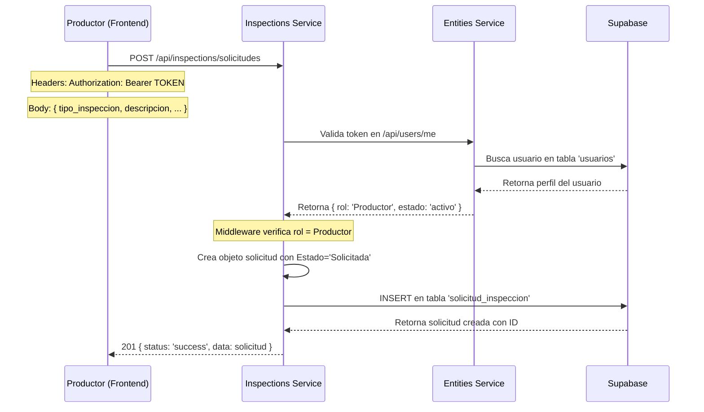
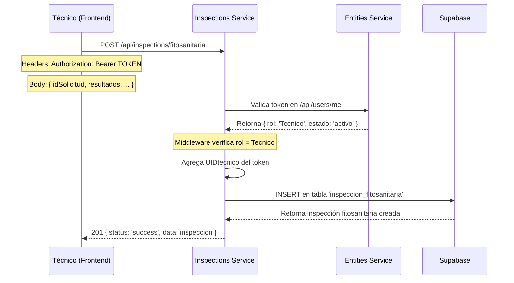
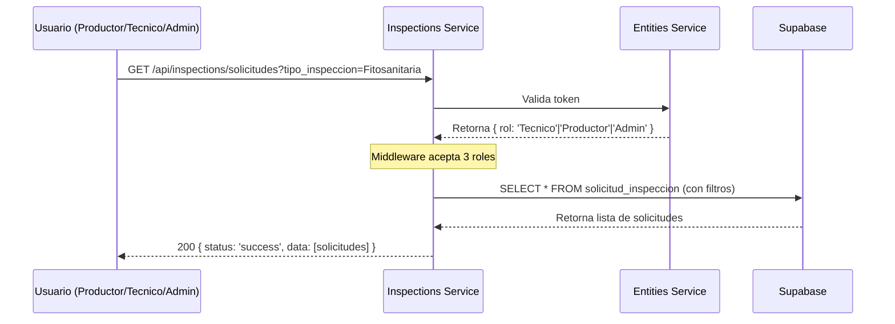

# 📋 Documentación Completa - Inspections Service

**Última actualización:** 13 de Mayo, 2026  
**Estado:** Análisis Completo realizado por Experto en Código  
**Versión del Servicio:** 1.0.0

---

## 📑 Tabla de Contenidos

1. [Resumen Ejecutivo](#resumen-ejecutivo)
2. [Arquitectura General](#arquitectura-general)
3. [Flujo de Operaciones](#flujo-de-operaciones)
4. [Estructura de Archivos](#estructura-de-archivos)
5. [Análisis Detallado por Módulo](#análisis-detallado-por-módulo)
6. [Patrones de Diseño Implementados](#patrones-de-diseño-implementados)
7. [Problemas Críticos Encontrados](#problemas-críticos-encontrados)
8. [Mejoras Recomendadas](#mejoras-recomendadas)
9. [Guía de Desarrollo](#guía-de-desarrollo)
10. [Flujos de Prueba](#flujos-de-prueba)

---

## 🎯 Resumen Ejecutivo

El **Inspections Service** es un microservicio de backend construido con **Express.js** que gestiona el ciclo de vida completo de inspecciones agrícolas:

- ✅ **Creación de solicitudes** de inspección por parte de Productores
- ✅ **Registro de inspecciones** en 3 tipos: Fitosanitaria, Técnica y por Lotes
- ✅ **Gestión de plagas** y conteo de plagas por lote
- ✅ **Control de acceso** basado en roles (Productor, Técnico, Admin)
- ✅ **Autenticación cruzada** con el servicio de Entidades (entities-service)

**Puerto por defecto:** `3002` (configurable vía `PORT` en `.env`)

**Dependencias externas:**
- Supabase (Base de datos PostgreSQL + Authentication)
- Entities Service (validación de usuarios y autorización)

---

## 🏗️ Arquitectura General

### Patrón Arquitectónico: MVC Modificado (CSR)

```
Routes (Express Routers)
    ↓
Controllers (Manejo de peticiones HTTP)
    ↓
Services (Lógica de negocio)
    ↓
Repositories (Acceso a datos)
    ↓
Supabase (Base de datos)
```

### Diagrama de Comunicación entre Servicios

```
Frontend (React App)
    ↓
Inspections Service (Puerto 3002)
    ├─→ Valida token remoto en Entities Service (Puerto 3001)
    │   └─→ Endpoints: GET /api/users/me
    └─→ Lee/Escribe en Supabase
         └─→ Tablas: solicitud_inspeccion, inspeccion_fitosanitaria, 
                     inspeccion_tecnica, inspeccion_lote, conteo_plagas
```

### Stack Tecnológico

| Componente | Versión | Propósito |
|-----------|---------|----------|
| Node.js | - | Runtime de JavaScript |
| Express.js | 5.2.1 | Framework web |
| Supabase JS | 2.102.1 | Cliente de BDD y Auth |
| CORS | 2.8.6 | Control de CORS |
| dotenv | 17.4.1 | Gestión de variables de entorno |

---

## 🔄 Flujo de Operaciones

### 1. Flujo: Crear Solicitud de Inspección (Productor)



### 2. Flujo: Técnico Completa Inspección Fitosanitaria



### 3. Flujo: Consultar Solicitudes (Multi-rol)



---

## 📂 Estructura de Archivos

```
inspections-service/
├── .env                          # Variables de entorno (NO versionado)
├── .gitignore                    # Exclusiones de Git
├── package.json                  # Dependencias y scripts
├── README.md                     # Documentación básica
├── instructions.md               # ESTE ARCHIVO
│
└── src/
    ├── index.js                  # Entry point - inicializa servidor
    ├── server.js                 # Configuración de Express
    │
    ├── config/
    │   ├── env.config.js         # Lectura de variables de entorno
    │   └── supabaseClient.js     # Inicialización de cliente Supabase
    │
    ├── middlewares/
    │   ├── authMiddleware.js     # Validación remota de tokens (crossServiceAuth)
    │   └── errorHandler.js       # Manejo centralizado de errores
    │
    ├── modules/
    │   └── inspections/
    │       ├── inspectionRoutes.js      # Definición de rutas HTTP
    │       ├── inspectionController.js  # Manejadores de peticiones
    │       ├── inspectionService.js     # Lógica de negocio
    │       └── inspectionRepository.js  # Acceso a datos (Supabase)
    │
    └── shared/
        ├── AppError.js           # Clase personalizada para errores operacionales
        └── ApiResponse.js        # Clase para respuestas HTTP consistentes
```

---

## 🔍 Análisis Detallado por Módulo

### 1️⃣ Módulo de Configuración

#### `config/env.config.js`

**Responsabilidad:** Centralizar lectura de variables de entorno.

```javascript
// Lectura de 4 variables críticas:
- PORT              // Puerto del servicio (default: 3002)
- SUPABASE_URL      // URL base de Supabase
- SUPABASE_ANON_KEY // Clave pública de Supabase
- ENTITIES_SERVICE_URL // URL del servicio de entidades (default: http://localhost:3001/api)
```

**Observación Importante:** Las variables se leen al iniciar la aplicación. Si falta `SUPABASE_URL` o `SUPABASE_ANON_KEY`, el cliente Supabase se inicializa con strings vacíos, lo cual causará errores silenciosos en runtime.

**Mejora recomendada:** Validar que las variables críticas existan antes de iniciar.

#### `config/supabaseClient.js`

**Responsabilidad:** Crear e inicializar el cliente de Supabase.

```javascript
const supabase = createClient(SUPABASE_URL, SUPABASE_ANON_KEY);
// Exporta instancia singleton para toda la aplicación
```

---

### 2️⃣ Módulo de Middlewares

#### `middlewares/authMiddleware.js` - El corazón de la autenticación

**Concepto:** Implementa **autenticación cruzada entre microservicios**.

```
┌─────────────────────────────────────────────────────────┐
│  crossServiceAuth(...roles)                             │
│  ────────────────────────────────────────────────────────│
│  1. Lee header Authorization del request                │
│  2. Llama a Entities Service: GET /api/users/me         │
│  3. Valida que Entities Service devuelva el perfil      │
│  4. Valida que el rol esté en la lista permitida        │
│  5. Valida que estado === 'activo'                      │
│  6. Continúa al siguiente middleware/controller         │
└─────────────────────────────────────────────────────────┘
```

**Función Principal: `getProfileFromEntitiesService(authHeader)`**

```javascript
// Recibe: "Bearer TOKEN_AQUI"
// Realiza: POST http://localhost:3001/api/users/me
// Headers: { 'Authorization': 'Bearer TOKEN_AQUI' }
// 
// Retorna: { id, nombre, rol, estado, ... } (perfil del usuario)
// 
// Errores posibles:
// - 401: Token inválido o expirado
// - 403: Usuario no autorizado
// - 500: Error comunicando con Entities Service
```

**Función Principal: `crossServiceAuth(...roles)`**

```javascript
// Middleware factory que acepta variable número de roles

// Ejemplos:
crossServiceAuth('Productor')              // Solo Productor
crossServiceAuth('Tecnico', 'Admin')       // Técnico o Admin
crossServiceAuth()                         // Cualquier usuario autenticado
```

**⚠️ PROBLEMA CRÍTICO IDENTIFICADO:**

En línea 2 del archivo:
```javascript
const { AppError } = require('../shared/AppErrorAndResponse');
```

**PERO** los archivos reales están separados:
- `../shared/AppError.js` (existe)
- `../shared/ApiResponse.js` (existe)
- `../shared/AppErrorAndResponse.js` (NO existe)

**Resultado:** El archivo importa un módulo inexistente, causando error `MODULE_NOT_FOUND` en runtime.

#### `middlewares/errorHandler.js`

**Responsabilidad:** Capturar y formatear TODOS los errores de la aplicación.

```javascript
errorHandler(err, req, res, next)
├─ Si err.isOperational === true
│  └─ Responde: { status: 'error', message: '...' } (HTTP específico)
│
└─ Si NO es operacional (error no capturado)
   ├─ Loguea en consola: console.error('ERROR 💥:', err)
   └─ Responde: HTTP 500 + 'Internal Server Error'
```

**Integración:** Debe ser el último middleware registrado en `server.js`:

```javascript
app.use(inspectionRoutes);
app.use(errorHandler);  // ← Captura todas las excepciones
```

---

### 3️⃣ Módulo de Routes (Rutas HTTP)

#### `modules/inspections/inspectionRoutes.js`

Define **6 endpoints** organizados por rol:

| Método | Ruta | Rol Requerido | Controlador |
|--------|------|---------------|------------|
| POST | `/api/inspections/solicitudes` | Productor | `solicitInspection` |
| GET | `/api/inspections/solicitudes` | Tecnico, Admin, Productor | `fetchSolicitudes` |
| POST | `/api/inspections/fitosanitaria` | Tecnico | `submitFito` |
| POST | `/api/inspections/tecnica` | Tecnico | `submitTecnica` |
| POST | `/api/inspections/conteo-lotes` | Tecnico | `addLoteWithPests` |

**Patrón en cada ruta:**

```javascript
router.post('/solicitudes', 
  crossServiceAuth('Productor'),        // ← Validar rol y autenticación
  inspectionController.solicitInspection // ← Ejecutar controlador
);
```

---

### 4️⃣ Módulo de Controllers (Manejadores de Peticiones)

#### `modules/inspections/inspectionController.js`

**Responsabilidad:** Convertir datos HTTP en llamadas al servicio.

**Patrón en cada método:**

```javascript
async solicitInspection(req, res, next) {
  try {
    // 1. Extraer datos del request
    const { body } = req;
    const userId = req.user.id;  // ← Viene del middleware
    
    // 2. Llamar al servicio
    const result = await inspectionService.reqInspection(body, userId);
    
    // 3. Retornar respuesta exitosa
    return ApiResponse.success(res, result, 'mensaje', 201);
  } catch (err) {
    // 4. Pasar error al middleware global
    next(err);
  }
}
```

**Métodos implementados:**

| Método | Petición HTTP | Descripción |
|--------|---------------|------------|
| `solicitInspection` | POST /solicitudes | Crea solicitud de inspección |
| `fetchSolicitudes` | GET /solicitudes | Lista solicitudes con filtros |
| `submitFito` | POST /fitosanitaria | Completa inspección fitosanitaria |
| `submitTecnica` | POST /tecnica | Completa inspección técnica |
| `addLoteWithPests` | POST /conteo-lotes | Registra lote + conteo de plagas |

**⚠️ PROBLEMA 2 IDENTIFICADO:**

Línea 2:
```javascript
const { ApiResponse } = require('../../shared/AppErrorAndResponse');
```

Mismo problema: intenta importar `AppErrorAndResponse` que no existe.

---

### 5️⃣ Módulo de Services (Lógica de Negocio)

#### `modules/inspections/inspectionService.js`

**Responsabilidad:** Aplicar reglas de negocio y orquestar operaciones.

```javascript
class InspectionService {
  // 1. Crear solicitud
  async reqInspection(data, producerId)
    ├─ Enriquece datos: agrega UIDProductor y Estado='Solicitada'
    └─ Delega inserción al repositorio
  
  // 2. Obtener todas las solicitudes
  async getAllSolicitudes(filters)
    └─ Delega consulta con filtros al repositorio
  
  // 3. Llenar inspección fitosanitaria
  async fillFitosanitaria(data, technicalId)
    ├─ Enriquece datos: agrega UIDtecnico
    └─ Delega inserción al repositorio
  
  // 4. Llenar inspección técnica
  async fillTecnica(data, technicalId)
    └─ Delega inserción al repositorio
  
  // 5. Agregar lote Y plagas (operación múltiple)
  async addLoteAndPests(loteData, pestsDataArray)
    ├─ INSERT lote en tabla 'inspeccion_lote'
    └─ Para cada plaga:
       └─ INSERT en tabla 'conteo_plagas' con referencia al lote
}
```

**Punto Crítico:** El método `addLoteAndPests` realiza múltiples operaciones sin transacción. Si la 3ª inserción de plaga falla, quedan las anteriores registradas.

---

### 6️⃣ Módulo de Repositories (Acceso a Datos)

#### `modules/inspections/inspectionRepository.js`

**Responsabilidad:** ÚNICA lectura/escritura en Supabase.

**Estructura de cada método:**

```javascript
async createSolicitud(data) {
  const { data: result, error } = await supabase
    .from('solicitud_inspeccion')        // ← Tabla
    .insert([data])                      // ← INSERT
    .select()                            // ← Retorna fila insertada
    .single();                           // ← Una sola fila
    
  if (error) throw new AppError(error.message, 400);
  return result;
}
```

**Tablas de Supabase utilizadas:**

| Tabla | Operación | Notas |
|-------|-----------|-------|
| `solicitud_inspeccion` | INSERT, SELECT | Creada por Productor |
| `inspeccion_fitosanitaria` | INSERT | Creada por Técnico |
| `inspeccion_tecnica` | INSERT | Creada por Técnico |
| `inspeccion_lote` | INSERT | Creada por Técnico |
| `conteo_plagas` | INSERT | Registra plagas/lote |

**Métodos sin filtros complejos:**

```javascript
async getSolicitudes(filters = {}) {
  let query = supabase.from('solicitud_inspeccion').select('*');
  if (filters.tipo_inspeccion) 
    query = query.eq('tipo_inspeccion', filters.tipo_inspeccion);
  const { data, error } = await query;
  if (error) throw new AppError(error.message, 500);
  return data;
}
```

**⚠️ LIMITACIÓN:** Sin paginación, si hay 10,000 solicitudes, retorna todas.

---

### 7️⃣ Módulo de Clases Compartidas

#### `shared/AppError.js`

```javascript
class AppError extends Error {
  constructor(message, statusCode) {
    super(message);
    this.statusCode = statusCode;      // ← HTTP status (400, 401, 403, 500)
    this.status = 'fail' | 'error';    // ← Categoría (4xx vs 5xx)
    this.isOperational = true;         // ← Marca para el errorHandler
  }
}
```

**Uso:**
```javascript
throw new AppError('Usuario no encontrado', 404);
throw new AppError('No autorizado', 403);
throw new AppError('Error de base de datos', 500);
```

#### `shared/ApiResponse.js`

```javascript
class ApiResponse {
  static success(res, data, message = 'Success', statusCode = 200)
    ├─ Retorna: { status: 'success', message, data }
    └─ HTTP: 200 (default)
  
  static error(res, message = 'Error', statusCode = 500, details = null)
    ├─ Retorna: { status: 'error', message, details? }
    └─ HTTP: 500 (default)
}
```

**Uso:**
```javascript
// Éxito
ApiResponse.success(res, { id: 1, ... }, 'Creado', 201);

// Error
ApiResponse.error(res, 'Usuario no encontrado', 404);
```

---

### 8️⃣ Servidor Express

#### `server.js`

```javascript
const app = express();

// 1. Middlewares globales
app.use(cors());                    // ← Permite CORS desde frontend
app.use(express.json());            // ← Parse JSON

// 2. Endpoint de salud
app.get('/api/health', ...)         // ← Para health checks

// 3. Rutas de negocio
app.use('/api/inspections', inspectionRoutes);

// 4. Manejo de errores (DEBE ser último)
app.use(errorHandler);

module.exports = app;
```

#### `index.js`

```javascript
const app = require('./server');
const env = require('./config/env.config');

app.listen(env.PORT, () => {
  console.log(`🚀 Inspections Service corriendo en el puerto ${env.PORT}`);
});
```

---

## 🎨 Patrones de Diseño Implementados

### ✅ Patrón MVC (Modificado a CSR)

- **C**ontroller → **S**ervice → **R**epository
- Separación de responsabilidades clara
- Fácil de testear capas por separado

### ✅ Singleton Pattern

- `inspectionService` se instancia una sola vez
- `inspectionRepository` se instancia una sola vez
- `supabase` cliente singleton

### ✅ Middleware Chain Pattern

```
Request → CORS → JSON Parser → Router → crossServiceAuth 
→ Controller → Service → Repository → Supabase → 
Response → errorHandler → Client
```

### ✅ Factory Pattern

- `crossServiceAuth(...roles)` es una factory que retorna un middleware

### ⚠️ Falta: Dependency Injection

Las dependencias se requieren directamente, no se inyectan:

```javascript
// Actual (acoplamiento)
const inspectionRepository = require('./inspectionRepository');

// Recomendado (inyectado)
class InspectionService {
  constructor(repository) {
    this.repository = repository;
  }
}
```

---

## 🚨 Problemas Críticos Encontrados

### 🔴 PROBLEMA 1: Importación de módulo inexistente

**Ubicación:** 
- `inspectionService.js` línea 2
- `inspectionController.js` línea 2
- `authMiddleware.js` línea 2

**Código problemático:**
```javascript
const { AppError } = require('../../shared/AppErrorAndResponse');
const { ApiResponse } = require('../../shared/AppErrorAndResponse');
```

**Causa:** El archivo `AppErrorAndResponse.js` NO existe. Los archivos reales son separados:
- `AppError.js`
- `ApiResponse.js`

**Consecuencia:** 💥 **Error inmediato al importar:** `MODULE_NOT_FOUND`

**Solución:**

```javascript
// Cambiar EN TODOS los archivos mencionados:

// ❌ INCORRECTO
const { AppError } = require('../../shared/AppErrorAndResponse');

// ✅ CORRECTO
const AppError = require('../../shared/AppError');
const { ApiResponse } = require('../../shared/ApiResponse');
```

---

### 🔴 PROBLEMA 2: Endpoint faltante en Entities Service

**Descripción:** El middleware `crossServiceAuth` intenta validar el token llamando a:

```javascript
const response = await fetch(`${env.ENTITIES_SERVICE_URL}/users/me`, {
  headers: { 'Authorization': authHeader }
});
```

**Pero:** Este endpoint **NO existe** en `entities-service`.

**Consecuencia:** Toda solicitud de inspección retorna 404 o 500.

**Solución:** Implementar `/api/users/me` en entities-service.

Ejemplo del endpoint faltante:

```javascript
// En entities-service/src/modules/users/userRoutes.js
router.get('/me', authMiddleware, userController.getMe);

// En entities-service/src/modules/users/userController.js
async getMe(req, res, next) {
  try {
    const userId = req.user.id; // Del authMiddleware
    const user = await userService.getUserById(userId);
    return ApiResponse.success(res, user, 'Perfil obtenido');
  } catch(err) {
    next(err);
  }
}
```

---

### 🔴 PROBLEMA 3: Sin transacciones en operaciones múltiples

**Ubicación:** `inspectionService.js`, método `addLoteAndPests`

```javascript
async addLoteAndPests(loteData, pestsDataArray) {
  // 1. INSERT lote
  const lote = await inspectionRepository.createInspeccionLote(loteData);
  const conteos = [];
  
  // 2. Para cada plaga, INSERT
  for (const pst of pestsDataArray) {
    const pestBody = { ...pst, idInspeccionLote: lote.id };
    const res = await inspectionRepository.addConteoPlaga(pestBody);
    conteos.push(res);  // ← Si falla aquí, qué pasó con el lote?
  }
  return { lote, conteos };
}
```

**Problema:** Si la plaga 3 de 5 falla, quedan registradas 2 plagas sin las otras 3.

**Consecuencia:** Inconsistencia de datos.

**Solución:** Usar transacción de Supabase:

```javascript
async addLoteAndPests(loteData, pestsDataArray) {
  // TODO: Implementar con rpc() o manejo de transacción
  const { data, error } = await supabase.rpc('create_lote_with_pests', {
    p_lote_data: loteData,
    p_pests_array: pestsDataArray
  });
  
  if (error) throw new AppError(error.message, 500);
  return data;
}
```

---

### 🟡 PROBLEMA 4: Sin validación de entrada

**Ubicación:** Todos los controladores

**Ejemplo:** `solicitInspection(req, res, next)`

```javascript
async solicitInspection(req, res, next) {
  try {
    const result = await inspectionService.reqInspection(
      req.body,  // ← ¿Qué si viene vacío? ¿Campos inválidos?
      req.user.id
    );
    // ...
  }
}
```

**Falta:** Validación de que los campos requeridos existan y tengan tipos correctos.

**Solución:** Crear validadores (similar a `userValidator.js` en entities-service):

```javascript
// inspectionValidator.js
const validateSolicitudData = (data) => {
  if (!data.tipo_inspeccion || !['Fitosanitaria', 'Tecnica', 'Lotes'].includes(data.tipo_inspeccion)) {
    throw new AppError('tipo_inspeccion inválido', 400);
  }
  if (!data.descripcion || typeof data.descripcion !== 'string') {
    throw new AppError('descripcion requerida', 400);
  }
  // ... más validaciones
};
```

---

### 🟡 PROBLEMA 5: Sin paginación en consultas

**Ubicación:** `inspectionRepository.js`, método `getSolicitudes`

```javascript
async getSolicitudes(filters = {}) {
  let query = supabase.from('solicitud_inspeccion').select('*');
  // ...
  const { data, error } = await query;  // ← Retorna TODAS las filas
  return data;
}
```

**Consecuencia:** Si hay 100,000 solicitudes, retorna todas en una sola petición.

**Problema:** Lentitud, consumo de memoria, timeout.

---

### 🟡 PROBLEMA 6: Sin logging estructurado

**Ubicación:** En todo el código

Solo hay `console.log()` en `index.js`:
```javascript
console.log(`🚀 Inspections Service corriendo en el puerto ${env.PORT}`);
```

Y `console.error()` en `errorHandler.js`:
```javascript
console.error('ERROR 💥:', err);
```

**Falta:** Logging de todas las operaciones: inicios, errores, timestamps, etc.

---

### 🟡 PROBLEMA 7: Variables de entorno sin validación

**Ubicación:** `config/supabaseClient.js`

```javascript
if (!env.SUPABASE_URL || !env.SUPABASE_ANON_KEY) {
  console.warn('⚠️ Faltan variables de entorno de Supabase 2 (Inspecciones).');
}

const supabase = createClient(env.SUPABASE_URL || '', env.SUPABASE_ANON_KEY || '');
// ↑ Se inicializa con strings vacíos, causará errores silenciosos
```

---

### 🟡 PROBLEMA 8: Sin validación de autorización granular

**Descripción:** Se valida que el usuario sea Productor/Técnico/Admin, pero NO se valida:

- ¿El Productor puede ver/editar SOLO sus propias solicitudes?
- ¿El Técnico puede ver TODAS las solicitudes?
- ¿El técnico que completa una inspección es el asignado?

**Ejemplo de falla:** Un Productor podría editar la solicitud de otro Productor.

---

## ✨ Mejoras Recomendadas

### 🟢 PRIORIDAD ALTA

#### 1. Corregir imports (FIX INMEDIATO)

**Archivos a modificar:** 3
- `authMiddleware.js`
- `inspectionController.js`
- `inspectionService.js`

**Cambio:**
```javascript
// ❌ CAMBIAR
const { AppError } = require('../../shared/AppErrorAndResponse');
const { ApiResponse } = require('../../shared/AppErrorAndResponse');

// ✅ A ESTO
const AppError = require('../../shared/AppError');
const ApiResponse = require('../../shared/ApiResponse');  // Nota: sin destructuring
```

#### 2. Implementar endpoint `/api/users/me` en entities-service

**Por qué:** Sin este endpoint, el middleware de inspections-service no puede validar usuarios.

**Tiempo estimado:** 30-45 minutos

#### 3. Crear validadores de entrada

**Archivo nuevo:** `modules/inspections/inspectionValidator.js`

**Validar en cada endpoint:**
- POST /solicitudes → validar tipo_inspeccion, descripcion
- POST /fitosanitaria → validar idSolicitud, resultados
- POST /tecnica → validar idSolicitud, observaciones
- POST /conteo-lotes → validar loteData, conteosPlagas

---

### 🟢 PRIORIDAD MEDIA

#### 4. Agregar paginación a `getSolicitudes`

```javascript
async getSolicitudes(filters = {}) {
  const page = filters.page || 1;
  const limit = filters.limit || 10;
  const offset = (page - 1) * limit;
  
  let query = supabase
    .from('solicitud_inspeccion')
    .select('*', { count: 'exact' });
    
  if (filters.tipo_inspeccion) 
    query = query.eq('tipo_inspeccion', filters.tipo_inspeccion);
    
  const { data, error, count } = await query
    .range(offset, offset + limit - 1);
    
  if (error) throw new AppError(error.message, 500);
  
  return {
    data,
    pagination: {
      page,
      limit,
      total: count,
      pages: Math.ceil(count / limit)
    }
  };
}
```

#### 5. Usar transacciones para operaciones múltiples

```javascript
async addLoteAndPests(loteData, pestsDataArray) {
  try {
    // Inicia transacción
    const { data: lote, error: loteError } = await supabase
      .from('inspeccion_lote')
      .insert([loteData])
      .select()
      .single();
    
    if (loteError) throw loteError;
    
    // Si el lote se creó, agregar plagas
    const conteos = [];
    for (const pst of pestsDataArray) {
      const { data: conteo, error: pestError } = await supabase
        .from('conteo_plagas')
        .insert([{ ...pst, idInspeccionLote: lote.id }])
        .select()
        .single();
      
      if (pestError) {
        // Rollback manual: eliminar lote
        await supabase.from('inspeccion_lote').delete().eq('id', lote.id);
        throw pestError;
      }
      conteos.push(conteo);
    }
    
    return { lote, conteos };
  } catch(err) {
    throw new AppError(err.message, 500);
  }
}
```

#### 6. Agregar logging estructurado

```javascript
// logger.js (nuevo archivo)
class Logger {
  info(action, data) {
    console.log(`[${new Date().toISOString()}] ℹ️ ${action}`, data);
  }
  
  warn(action, data) {
    console.warn(`[${new Date().toISOString()}] ⚠️ ${action}`, data);
  }
  
  error(action, error) {
    console.error(`[${new Date().toISOString()}] 🚨 ${action}`, error);
  }
}

module.exports = new Logger();
```

---

### 🟡 PRIORIDAD BAJA

#### 7. Autorización granular (Ownership check)

```javascript
// inspectionService.js
async getFiltredSolicitudes(filters, userProfile) {
  // Si es Productor, ver solo sus solicitudes
  if (userProfile.rol === 'Productor') {
    filters.UIDProductor = userProfile.id;
  }
  // Si es Técnico o Admin, ver todo
  
  return await inspectionRepository.getSolicitudes(filters);
}
```

#### 8. Documentación OpenAPI (Swagger)

Agregar dependencia `swagger-ui-express` y documentar todos los endpoints.

#### 9. Tests unitarios y e2e

- Jest para unit tests
- Supertest para e2e tests

#### 10. Manejo específico de errores de Supabase

```javascript
// Diferenciar entre error 400 (datos inválidos) vs 500 (BD caída)
if (error.code === 'PGRST116') {
  // Constraint violation
  throw new AppError('El registro ya existe', 409);
}
```

---

## 📚 Guía de Desarrollo

### Cómo agregar un nuevo endpoint

**Ejemplo:** Crear endpoint `GET /api/inspections/solicitudes/:id`

#### Paso 1: Agregar la ruta

```javascript
// inspectionRoutes.js
router.get('/:id', crossServiceAuth(), inspectionController.fetchSolicitudById);
```

#### Paso 2: Crear el controlador

```javascript
// inspectionController.js
async fetchSolicitudById(req, res, next) {
  try {
    const { id } = req.params;
    if (!id || isNaN(id)) {
      throw new AppError('ID inválido', 400);
    }
    
    const result = await inspectionService.getSolicitudById(id);
    return ApiResponse.success(res, result, 'Solicitud encontrada');
  } catch(err) {
    next(err);
  }
}
```

#### Paso 3: Crear el servicio

```javascript
// inspectionService.js
async getSolicitudById(id) {
  return await inspectionRepository.findSolicitudById(id);
}
```

#### Paso 4: Crear el repositorio

```javascript
// inspectionRepository.js
async findSolicitudById(id) {
  const { data, error } = await supabase
    .from('solicitud_inspeccion')
    .select('*')
    .eq('id', id)
    .single();
  
  if (error) {
    if (error.code === 'PGRST116') {
      throw new AppError('Solicitud no encontrada', 404);
    }
    throw new AppError(error.message, 500);
  }
  
  return data;
}
```

---

### Cómo debuggear problemas

#### 1. Error de autenticación (401 Unauthorized)

```
❌ Problema: crossServiceAuth retorna 401
✅ Solución:
   1. Verificar que el header Authorization esté presente
   2. Verificar que el token no esté expirado
   3. Verificar que entities-service esté corriendo en puerto 3001
   4. Verificar que /api/users/me esté implementado en entities-service
   5. Activar logging: console.log(authHeader) en authMiddleware
```

#### 2. Error al insertar solicitud (400 Bad Request)

```
❌ Problema: La base de datos rechaza el insert
✅ Solución:
   1. Verificar que los campos requeridos existan
   2. Verificar tipos de datos (string vs number vs date)
   3. Ver el error exacto de Supabase: console.log(error) en repository
   4. Validar esquema de la tabla en Supabase dashboard
```

#### 3. Error 500 Internal Server Error

```
❌ Problema: Error no controlado
✅ Solución:
   1. Ver el console.error en el errorHandler
   2. Verificar que SUPABASE_URL y SUPABASE_ANON_KEY estén en .env
   3. Verificar que el puerto 3002 esté disponible
   4. Verificar que entities-service esté corriendo
```

---

## 🧪 Flujos de Prueba

### Test 1: Crear Solicitud de Inspección

```bash
# 1. Obtener token (desde entities-service)
curl -X POST http://localhost:3001/api/users/login \
  -H "Content-Type: application/json" \
  -d '{
    "correo_electronico": "productor@example.com",
    "clave": "password123",
    "rol": "Productor"
  }'
# Guardar el token de la respuesta

# 2. Crear solicitud con el token
TOKEN="Bearer eyJhbGc..."
curl -X POST http://localhost:3002/api/inspections/solicitudes \
  -H "Authorization: $TOKEN" \
  -H "Content-Type: application/json" \
  -d '{
    "tipo_inspeccion": "Fitosanitaria",
    "descripcion": "Sospecha de plagas en lote A",
    "numero_lote": "A-001"
  }'
```

**Respuesta esperada:**
```json
{
  "status": "success",
  "message": "Solicitud de Inspección creada",
  "data": {
    "id": 1,
    "UIDProductor": "uuid-del-productor",
    "tipo_inspeccion": "Fitosanitaria",
    "Estado": "Solicitada",
    "created_at": "2026-05-13T10:30:00Z"
  }
}
```

---

### Test 2: Técnico Completa Inspección Fitosanitaria

```bash
TOKEN="Bearer eyJhbGc..."
SOLICITUD_ID=1

curl -X POST http://localhost:3002/api/inspections/fitosanitaria \
  -H "Authorization: $TOKEN" \
  -H "Content-Type: application/json" \
  -d '{
    "idSolicitud": '$SOLICITUD_ID',
    "resultados": "Se encontraron ácaros y pulgones",
    "recomendaciones": "Aplicar fungicida"
  }'
```

---

### Test 3: Obtener todas las solicitudes

```bash
TOKEN="Bearer eyJhbGc..."

curl -X GET "http://localhost:3002/api/inspections/solicitudes?tipo_inspeccion=Fitosanitaria" \
  -H "Authorization: $TOKEN"
```

---

## 📋 Checklist para Mejoras Futuras

### Esta Semana
- [ ] Corregir imports (Problema 1)
- [ ] Implementar `/api/users/me` en entities-service
- [ ] Crear validadores de entrada
- [ ] Escribir tests en Postman

### Próximas 2 Semanas
- [ ] Agregar paginación
- [ ] Implementar transacciones
- [ ] Logging estructurado
- [ ] Tests unitarios (Jest)

### Próximo Mes
- [ ] Autorización granular
- [ ] Documentación OpenAPI/Swagger
- [ ] Tests e2e
- [ ] Manejo específico de errores Supabase

---

## 🔗 Referencias y Enlaces

**Documentación relacionada:**
- [Supabase JavaScript Client](https://supabase.com/docs/reference/javascript)
- [Express.js Routing](https://expressjs.com/en/guide/routing.html)
- [Express Error Handling](https://expressjs.com/en/guide/error-handling.html)
- [CORS en Express](https://expressjs.com/en/resources/middleware/cors.html)

**Archivos relacionados en este proyecto:**
- `entities-service/src/modules/users/` (para ver patrón de validadores)
- `AGENTS.md` (instrucciones generales del proyecto)

---

## 📝 Notas Finales

### Resumen de Responsabilidades por Capa

| Capa | Responsabilidad | Archivos |
|------|-----------------|----------|
| **Routes** | Definir endpoints y middlewares | inspectionRoutes.js |
| **Controllers** | Parsear request, llamar servicio, retornar respuesta | inspectionController.js |
| **Services** | Lógica de negocio, enriquecimiento de datos | inspectionService.js |
| **Repositories** | ÚNICA lectura/escritura en BD | inspectionRepository.js |
| **Shared** | Clases reutilizables | AppError.js, ApiResponse.js |
| **Middlewares** | Validaciones transversales | authMiddleware.js, errorHandler.js |

### Reglas de Oro para Desarrollo

1. ✅ **Separación de Responsabilidades:** No mezclar lógica HTTP con lógica de BD
2. ✅ **Manejo de Errores:** Siempre hacer `next(err)` en catch, NO retornar directamente
3. ✅ **Validación:** Validar ENTRADA en Controllers, NEGOCIO en Services
4. ✅ **Transacciones:** Para múltiples operaciones relacionadas
5. ✅ **Logging:** Registrar inicio/fin de operaciones críticas
6. ✅ **Autorización:** Verificar propiedad de recursos antes de modificar

---

**Documento generado:** 13 de Mayo de 2026  
**Versión:** 1.0  
**Estado:** ✅ Completo y Listo para Desarrollo